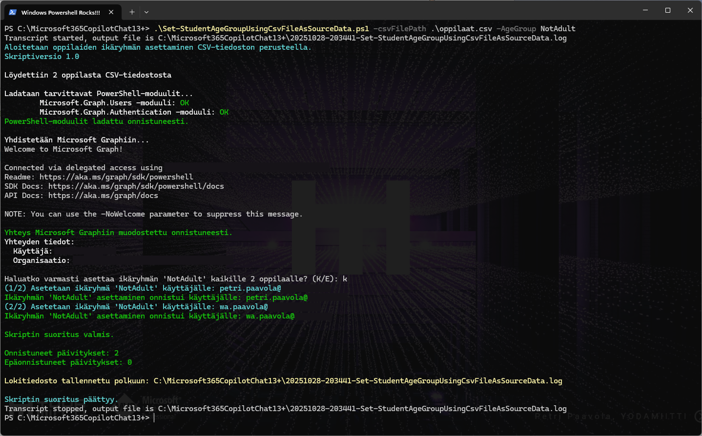

# Microsoft 365 Copilot Chat (13+) configuration examples to IT Administrators in Schools and Enterprises

Make Microsoft 365 Copilot Chat work smoothly for students (K12) and employees by configuring the AgeGroup attribute in Entra ID (Microsoft Graph). This guide includes quick manual commands and an automated script using a CSV source.

> Note: For K12 scenarios where students are 13+, setting AgeGroup correctly (typically NotAdult) is required for Microsoft 365 Copilot Chat enablement.

---

## Contents
- Resources: PDF slides
- Quick start: Manual update with PowerShell
- Script: [**Set-StudentAgeGroupUsingCsvFileAsSourceData.ps1**](./Set-StudentAgeGroupUsingCsvFileAsSourceData.ps1)
- CSV requirements (oppilaat.csv) + example
- Prerequisites and permissions
- Troubleshooting

---
## Resources
<!-- Clickable image preview that links to the PDF -->
[](/docs/Microsoft%20365%20Copilot%20Chat%20käyttöönotto%2013%2B%20oppilaille.pdf)

- PDF (slides exported from PowerPoint presentation): [Microsoft 365 Copilot Chat käyttöönotto 13+ oppilaille.pdf](/docs/Microsoft%20365%20Copilot%20Chat%20käyttöönotto%2013%2B%20oppilaille.pdf)

---

## Quick start: Manual update with PowerShell
Run the following commands in a PowerShell session (no admin needed for module install with -Scope CurrentUser):

```powershell
# Install required PowerShell module
Install-Module Microsoft.Graph.Users -Scope CurrentUser -Force

# Connect to Microsoft Graph API
Connect-MgGraph -Scopes "User.ReadWrite.All"

# Update single user/student AgeGroup value
Update-MgUser -UserId "etunimi.sukunimi@koulu.fi" -AgeGroup "NotAdult"
```

Supported AgeGroup values (as used by Microsoft Graph Users API):
- null (remove the value)
- Minor
- NotAdult
- Adult

> Tip: You can verify a user’s current value with:  
> `Get-MgUser -UserId "etunimi.sukunimi@koulu.fi" -Select Id, UserPrincipalName, AgeGroup | Select-Object Id, UserPrincipalName, AgeGroup`

---

## Script: `Set-StudentAgeGroupUsingCsvFileAsSourceData.ps1`
This script updates the AgeGroup for many users based on a CSV file containing a `UserPrincipalName` column.

<!-- Clickable image preview for script screenshot -->
<a href="/docs/Set-StudentAgeGroupUsingCsvFileAsSourceData-Screenshot.png">
    
</a>

### Key features
- Reads a CSV and updates users’ AgeGroup via Microsoft Graph
- Default AgeGroup is `NotAdult` (can be changed with `-AgeGroup`)
- Safe dry-run mode with `-WhatIf`
- Rich logging to transcript and a separate failed-updates file

### Parameters
- `-CsvFilePath <string>` (required): Path to the CSV file with `UserPrincipalName` column
- `-AgeGroup <string>` (optional): One of `null`, `Minor`, `NotAdult`, `Adult` (default: `NotAdult`)
- `-WhatIf` (switch, optional): Dry-run that shows what the script would do without making changes

### Example usage
```powershell
# Install required PowerShell modules (needed only once)
Install-Module Microsoft.Graph.Users -Scope CurrentUser -Force
Install-Module Microsoft.Graph.Authentication -Scope CurrentUser -Force

# Check connection and permissions to Microsoft Graph API works
# Note! Accept permissions only to Admin user, not all users in tenant
# Need to be only once for manual checking and actually same command is in script
# so technically no need to run this command separately at all.
Connect-MgGraph -Scopes "User.ReadWrite.All"

# Test run without actual changes using -WhatIf parameter
./Set-StudentAgeGroupUsingCsvFileAsSourceData.ps1 -CsvFilePath "./oppilaat.csv" -AgeGroup "NotAdult" -WhatIf

# Set AgeGroup to default value NotAdult for user in CSV file
# Tämä on lähtökohtaisesti K12-koulujen komento
./Set-StudentAgeGroupUsingCsvFileAsSourceData.ps1 -CsvFilePath "./oppilaat.csv"

# Specify -AgeGroup to needed value
./Set-StudentAgeGroupUsingCsvFileAsSourceData.ps1 -CsvFilePath "./oppilaat.csv" -AgeGroup "Adult"

```

### Logging
- Transcript log in the script folder:
  - `yyyyMMdd-HHmmss-Set-StudentAgeGroupUsingCsvFileAsSourceData.log`
- Failed updates log (only when an update fails in production mode):
  - `yyyyMMdd-HHmmss-Failed-User-Updates.log`

---

## CSV requirements (oppilaat.csv)
The CSV must contain the header `UserPrincipalName`. Each subsequent line should be a valid UPN/email for the target user.

Example `oppilaat.csv`:

```csv
UserPrincipalName
oppilas1.sukunimi1@koulu.fi
oppilas2.sukunimi2@koulu.fi
oppilas3.sukunimi3@koulu.fi
```

Notes:
- File encoding: UTF-8 is recommended
- The column name must match exactly: `UserPrincipalName`
- Empty rows or rows without `UserPrincipalName` will be skipped and counted as failures

---

## Prerequisites and permissions
- PowerShell 5.1 or PowerShell 7+
- Modules:
  - `Microsoft.Graph.Users`
  - `Microsoft.Graph.Authentication`
- Permissions: You need rights to update users (Graph scope `User.ReadWrite.All`). Your tenant’s admin may need to consent to the scope.

---

## Troubleshooting
- If module import fails, install modules explicitly:
  ```powershell
  Install-Module Microsoft.Graph.Users -Scope CurrentUser -Force
  Install-Module Microsoft.Graph.Authentication -Scope CurrentUser -Force
  ```
- Ensure you’re connected: `Get-MgContext` should return your account and tenant
- Verify the CSV path and that the file contains the `UserPrincipalName` header
- For dry-run testing, use `-WhatIf` first to confirm the scope of changes

---

### About this repository
This repository provides pragmatic examples for configuring Microsoft 365 Copilot Chat in school and enterprise environments, focusing on correct AgeGroup settings for students and staff. Contributions and improvements are welcome.
